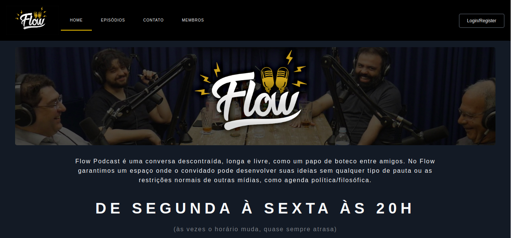

;

<h1 align='center'>

:microphone: Clone FlowPodcast
</h1>

Clone do site do Flow Podcast (com algumas alterações que julguei pertinentes).

<!--ts-->
   * [Sobre](#Sobre)
   * [Instalação](#instalacao)
   * [Paginas](#paginas) 
   * [Pré-requisitos](#pré-requisitos) 
   * [Tecnologias](#tecnologias)
   * [Autor](#autor)
<!--te-->

<h4 align="center"> 
	🚧  Clone FlowPodCast 🚀 Em construção...  🚧
</h4>

### Instalação

 - [x] Git Clone 

### Paginas

- [x] Pagina inicial
- [x] Episódios
- [ ] Contato
- [ ] Membros

### Pré-requisitos

- [x] Computador
- [x] Browser Atualizado

### 🛠 Tecnologias

As seguintes ferramentas foram usadas na construção do projeto:

- [HTML](https://developer.mozilla.org/pt-BR/docs/Web/HTML)
- [CSS](https://developer.mozilla.org/pt-BR/docs/Web/HTML)
- [Javascript](https://developer.mozilla.org/pt-BR/docs/Web/JavaScript)

### Autor
---

<a href="https://blog.rocketseat.com.br/author/thiago/">
 
  
 <b>Pedro Henrique</b></a> <a href="https://blog.rocketseat.com.br/author/thiago//" title="Rocketseat">🚀</a>

Feito por Pedro Henrique 👋🏽 Adiciona lá :D

